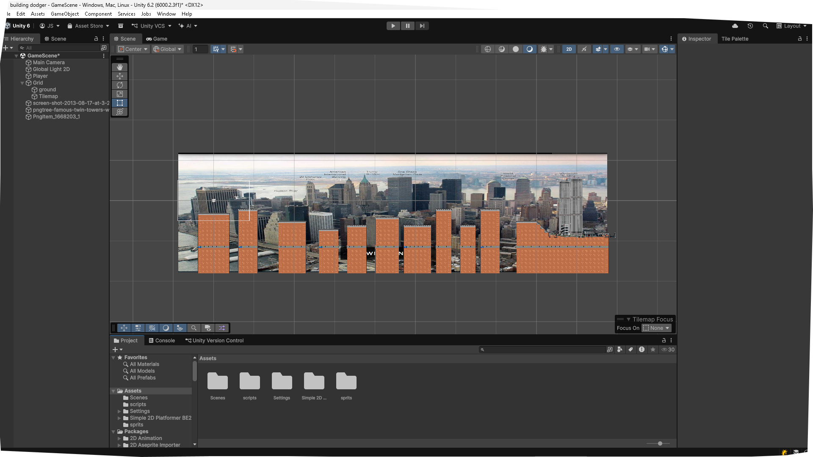
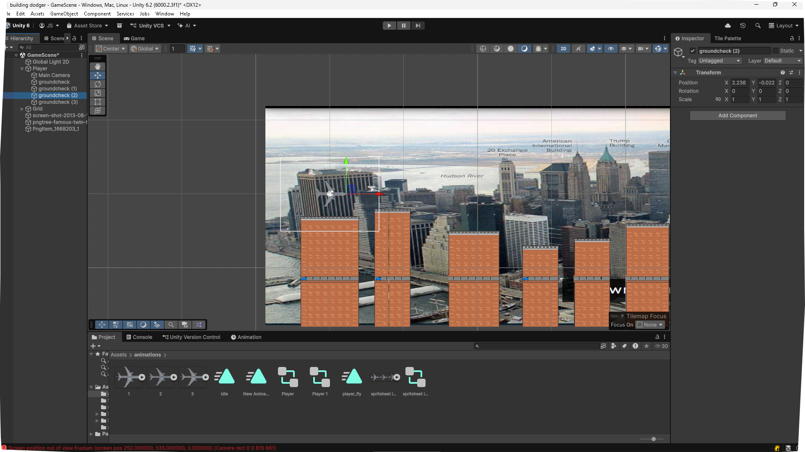
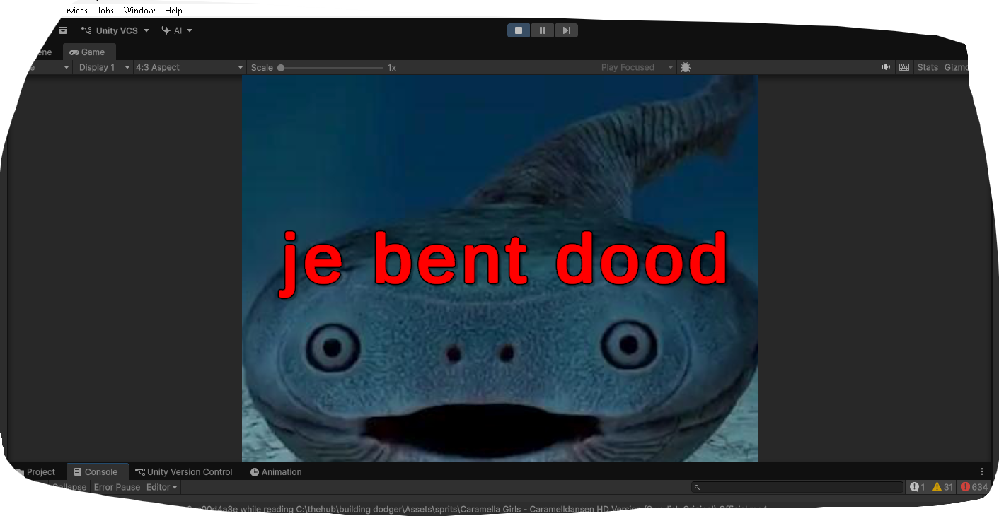

# log1

# 15:09 10-02-2026

---------------------------------------------------------------------------

# log2

# 14:40 12-02-2026

Ik heb animaties toegevoegd en like het werkt goed ofc want waarom zou het niet goed werken yk?

-----------------------------------------------------------------------------

# log3

# 14:46 12-02-2026

umm dit is een gif van de animatie en de movement :)

-----------------------------------------------------------------------------

# log4

# 12:56 13-02-2026

dus um er is nu movement en de level is groter en er is zo een ding zo like um moving platform dat!

-----------------------------------------------------------------------------

# log5

# 15:29 16-02-2026

ok so coins are added and music is in the deathscreen. also there are spikes and enemies so watch out for those! also um hidden secret where you can easily get rich!!!!!!!!!!!!

-----------------------------------------------------------------------------

# log6

# 23:33 17-02-2026

ok so wow... i added so much stuff!
stuff i added.  |
------------- | 
-poland level.|
-start menu.|
-level select menu.|
-fixed the hitbox of the airplane.|
-added like normal pictures for when you finish the level.|
-and just some stupid bugs that just pmo'd me and people who tried the game.|
-changed the level design on the USA map to make it a little easier...|
-fixed jumping not working on poland map.|
-added wall's to stop people from falling off the map in poland and USA map.|

and yea that is about it for now... tommorow i have nothing to do so expect another update!!!!!

## game release 1!!!!!!

so like yea this game is good enough to release if you ask me so yea! give it a shot :)

-----------------------------------------------------------------------------

# log7

# 23:55 17-02-2026

switched rendering mode from dx12 to dx11 for better older system compatibility (windows)

supported windows versions |
------------- | 
Windows 11 26h1  |
windows 10 21h2 |
windows 8.1 9600 |
windows 8 9200 |
windows 7 7601|

-----------------------------------------------------------------------------

# log8

# 00:15 18-02-2026

The first build is online!

it ofcourse has some issues that need to be fixed but that is expected from a alpha release. 

please turn down your volume! and if posible set your resolution to one of these

Recomended resolutions! |
------------- | 
640x480  |
800x600 |
1024x768 |
1280x960 |
1600x1200 |

if possible also turn off stretching on your display or in the settings of your operating system!\

good luck have fun and nighty nighty players... (-_-)。゜zｚＺ

